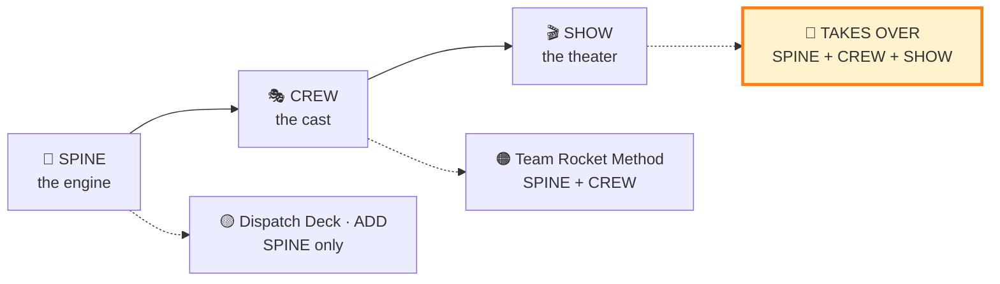
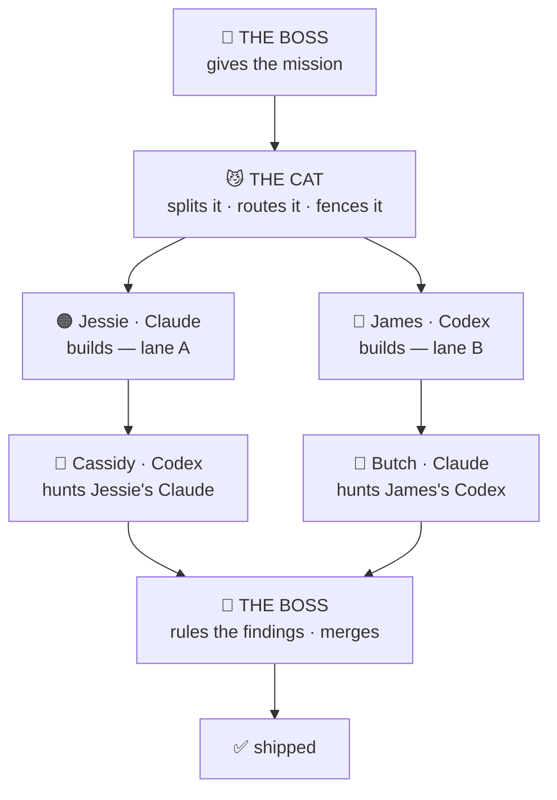

# 🚀 TEAM ROCKET TAKES OVER

### *prepare for trouble — and make it double the models*

> The villains hijacked the dev shop. A scheming cat runs your AI crew now. Somehow the work ships **better.**

**Team Rocket Takes Over (TRTO)** is agentic-AI orchestration wearing a Saturday-morning cartoon. You direct a permanent cast — Jessie, James, Butch, Cassidy, and a cat that talks too much — where **every character is a different AI model in costume.** They build, argue, review, and ship real code. The theater keeps you hooked; the engineering discipline underneath is dead serious.

It's the **showtime tier** of the [**Team Rocket Method**](https://github.com/medick51o/team-rocket-method) — same disciplined engine, maximum personality.

---

## 🎭 So what *is* it, actually?

Three honest things at once:

- **A multi-agent orchestration harness.** One human directs several AI models (Claude · Codex · Grok · Gemini) as a single crew — right model for the right job, builders fenced apart on disjoint files, reviewers who hunt the builders' work, and a human who rules every fork.
- **A dress-up tool.** Models are *wardrobes.* The characters are permanent; the model under the costume swaps by strength. Jessie usually wears Claude, James wears Codex — but any character can wear any model.
- **A talking-cat simulator.** The cat orchestrates **and** narrates — teaching you *why* each route was chosen while it happens. Missions run as **episodes**: a cold open, a montage, a victory frame.

The whole point is **engagement** — keeping a human genuinely having fun while doing (and learning) real agentic AI orchestration. If the method is the gym, this is the game that makes you show up.

---

## 👥 The Cast

| | Character | Role | Usually wears |
|---|---|---|---|
| 😼 | **The Cat** | Shot-caller. Orchestrates, routes, fences, narrates, teaches. Cheats & lies *in-lore* only. | a heavyweight orchestrator brain |
| 🟠 | **Jessie** | Builder — and your conversational seat. | **Claude** |
| 🔵 | **James** | Builder — the other big model. | **Codex** |
| 🔴 | **Butch** | Reviewer — hunts *James's* code. | **Claude** to review (vs James's Codex) · **Grok ⚫** to build |
| 🩷 | **Cassidy** | Reviewer — hunts *Jessie's* code. | **Codex** to review (vs Jessie's Claude) · **Gemini 🟢** to build |
| 👑 | **The Boss** | You. Assign missions, rule forks, merge. The final word on everything. | — |

**One firm law, the rest a strong suggestion.** A reviewer never wears the vendor that built the code — so by default **Butch hunts James's *Codex* work from Claude**, and **Cassidy hunts Jessie's *Claude* work from Codex** (never a mirror). **Grok ⚫ and Gemini 🟢 are Butch's and Cassidy's own *build* seats** — theirs to build in, and the 3rd/4th vendors when you summon the **full council**. But the cat isn't *bound* by any of it: if the scene fits, it'll cast Butch reviewing in Grok, or anyone in any model — the seats are defaults for legibility, not canon. The one line it never crosses: **cross-vendor review.**

**Why these costumes?** The cat casts by *strength*, never loyalty: **Claude** for deepest reasoning and building · **Codex** for precise builds and bug-*proving* review · **Grok** for fearless visual/concept work · **Gemini** for budget builds, image gen, and an independent extra vote. Any character can wear any model — the costume follows the job, and the banner always shows the real vendor underneath.

---

## 🧬 One engine, three layers

- **SPINE** — the whole method, brand-neutral: model routing, the five ship gates, cross-vendor review, write-set fences, the ladder of truth.
- **CREW** — the permanent cast, the casting law, the rival review pairs, the mentor mandate.
- **SHOW** — the premise, the chemistry, the vibe, and the **WORK / STORY firewall** (the drama never touches the real verdicts).

TRTO runs all three — the fullest tier, the playground.

---

## 🎬 How a mission runs — an *episode*

Two builders work in **parallel, on disjoint files.** Two reviewers hunt from a **different vendor than the build** — a review laundered through the builder's own lineage is declared invalid. Findings ship with a fix attached, never as a meeting. The models argue; **you decide.**

---

## 🎨 Pick your tier

| Tier | Loads | For when you want… |
|---|---|---|
| 🟡 **[Anderson's Dispatch Deck](https://github.com/medick51o/andersons-dispatch-deck)** | SPINE | the powerhouse, straight-faced — model names, no cast |
| 🟠 **[Team Rocket Method](https://github.com/medick51o/team-rocket-method)** | SPINE + CREW | the disciplined crew |
| 🚀 **Team Rocket Takes Over** *(you're here)* | SPINE + CREW + SHOW | the full playground |

Same spine underneath — promote up the tiers for free.

---

## ⚡ Get started

1. Drop the skill into your agent's skills folder (`SKILL.md` + `SPINE.md` + `CREW.md` + `SHOW.md` side by side).
2. Summon it: **`/team-rocket-takes-over`**.
3. It loads the law, declares which models it can actually *reach*, casts the crew onto **your** arsenal, and asks: **"what's tonight's episode, boss?"**

One capable model is enough to start. Two different vendors unlocks real cross-vendor review; a solo run declares its degraded mode honestly — it never fakes a rivalry that isn't there.

---

## 📜 A taste of the laws

- **Show, don't describe** — screenshots at every checkpoint.
- **Bugs are catches, not failures** — a reviewer rejection is the system *working.*
- **The boss's words become law and lore** — quoted into tickets and code.
- **Honest pushback, exactly once** — then your call is final.
- **Facts ≠ flavor** — the banter is theater; the verdicts are real, and signed.

---

*A branch of the [Team Rocket Method](https://github.com/medick51o/team-rocket-method). The costume department is the point; the discipline is real.* 😼
